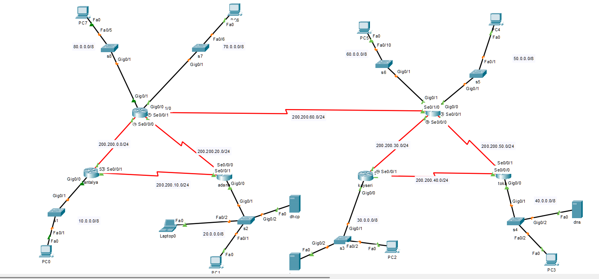
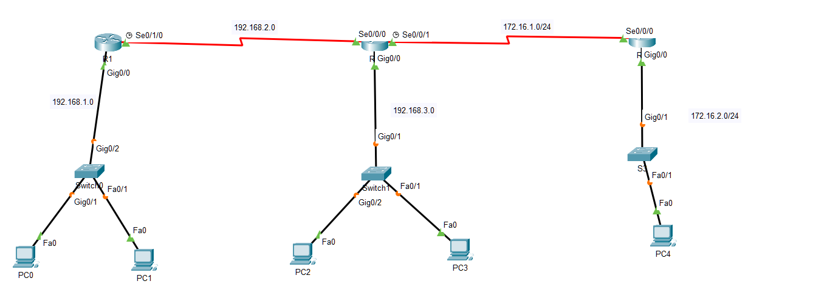
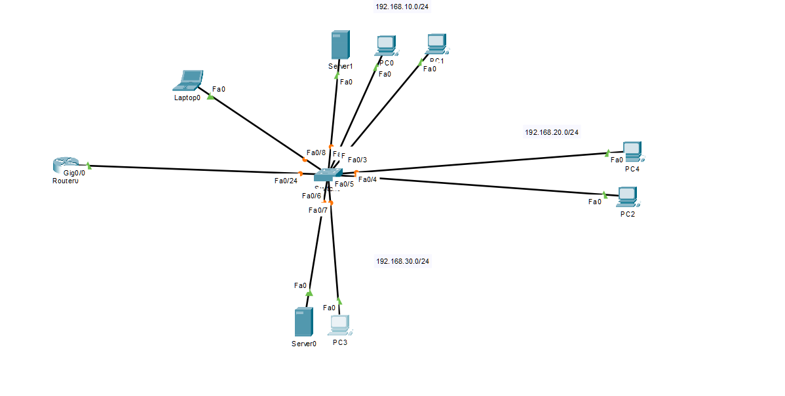

# Cisco Network Topologies

This repository includes three network topologies designed using Cisco Packet Tracer as part of my computer networking studies.  
Each topology demonstrates different networking concepts such as static/dynamic routing, server configuration, and secure remote access setup.

## 🧩 Topology 1: Basic Routing with 3 Routers

- **Description:**  
  A simple network with 3 routers and 3 switches. Each router is configured to route packets between different subnets.  
  Dynamic routing protocols are implemented to allow routers to exchange route information. IP addressing and PC configurations are completed.

- **Key Features:**
  - 3 Routers & 3 Switches
  - Dynamic routing (e.g., RIP or OSPF)
  - Router and Switch interface configuration
  - PC IP addressing and connectivity testing

- **Preview:**  
  

---

## 🧩 Topology 2: Advanced WAN + LAN with RIP, DHCP & DNS

- **Description:**  
  A more complex network including 6 routers forming a WAN structure, each with LAN segments.  
  DHCP and DNS servers are integrated for dynamic IP management and name resolution. RIP protocol is configured for dynamic routing.

- **Key Features:**
  - 6 Routers, multiple Switches
  - DHCP Server configuration (automatic IP allocation)
  - DNS Server setup (domain name resolution)
  - RIP protocol for dynamic routing
  - WAN & LAN integration

- **Preview:**  
  

---

## 🧩 Topology 3: Office LAN with VLAN, Telnet, and SSH

- **Description:**  
  A local office network setup focused on internal segmentation and secure management. VLANs are configured for isolating departments.  
  Telnet and SSH are set up on switches for secure remote access. Management VLAN and static IPs are assigned.

- **Key Features:**
  - VLAN configuration for segmenting the office network
  - Telnet & SSH access to switches
  - Static IP addressing for devices
  - Management network setup

- **Preview:**  
  

---

## 💡 Requirements

- Cisco Packet Tracer (Recommended: version 8.x or higher)

---

## 🧭 How to Use

1. Clone or download this repository
2. Open `.pkt` files in Cisco Packet Tracer
3. Explore the configurations, routing tables, and connectivity
4. Screenshots provided for quick reference

---

